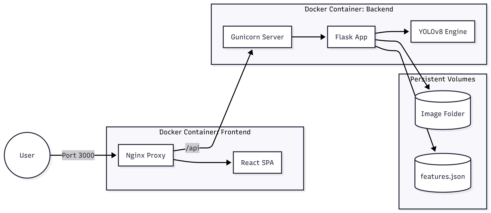

This is the comprehensive, professional `README.md` for your project. It includes a detailed explanation of the **AI Pipeline**, the **DevOps architecture**, and placeholders for your workflow images.

---

# 🖼️ SmartGallery CBIR System
### *AI-Powered Content-Based Image Retrieval with YOLOv8*

SmartGallery is a high-performance **Full-Stack CBIR (Content-Based Image Retrieval)** system. It allows users to upload images, automatically detect objects using a fine-tuned **YOLOv8** model, extract deep visual features (Color, Texture, Shape), and perform similarity searches across a gallery.

---

## 🛠️ Technology Stack
- **Frontend:** React.js (Vite), TailwindCSS, Axios.
- **Backend:** Flask, Flask-RESTful, Gunicorn.
- **AI/ML:** Ultralytics YOLOv8, OpenCV, Scikit-Learn, Scikit-Image.
- **DevOps:** Docker, Docker Compose, Nginx (Reverse Proxy).

---

## 🔄 The AI Pipeline Workflow

The system follows a sophisticated 5-step pipeline to ensure high-accuracy image retrieval:

### 1. Image Ingestion & Management
User uploads an image via the React interface. The **ImageManager** service handles storage and serves the files through an Nginx-proxied static route.

### 2. Object Detection (YOLOv8)
The backend runs the query image through a fine-tuned **YOLOv8n** model trained on 15 specific categories. It identifies bounding boxes (BBox) and class labels.
> **Categories:** *Person, Bicycle, Car, Airplane, Boat, Traffic Light, Bird, Cat, Dog, Horse, Umbrella, Bottle, Apple, Pizza, Laptop.*

### 3. Background Removal (Segmentation)
To ensure color features are extracted only from the object (and not the background), the system uses **YOLOv8-Segmentation**.
> *Workflow:* BBox -> Mask Generation -> Bitwise-AND Masking -> Isolated Object ROI.

### 4. Multimodal Feature Extraction
For every isolated object, we extract:
- **Color:** RGB/HSV Histograms & K-Means Dominant Colors (5 clusters).
- **Texture:** Tamura Descriptors (Contrast, Coarseness) & Gabor Filters.
- **Shape:** Hu Moments & Histogram of Oriented Gradients (HOG).

### 5. Similarity Search
Query features are compared against the `features.json` database using a **Weighted Euclidean Distance** algorithm. Results are filtered by class to ensure semantic relevance.

---

## 📸 Workflow Demonstration

| Step 1: Upload & Detect | Step 2: Segmentation | Step 3: Similarity Search |
| :---: | :---: | :---: |
|  |  |  |
| *YOLO identifies the Dog/Horse* | *Background is set to black* | *Top K matches from gallery* |

---

## 🏗️ DevOps Architecture

The project is built with a production-first Docker architecture:

<p align="center">
  <b>Shape-based Retrieval Example</b><br>
  <br><br>
</p>

### Key Optimizations:
- **Offline Inference:** `YOLO_OFFLINE=True` environment variable prevents the system from crashing due to GitHub rate limits or lack of internet.
- **Reverse Proxy:** Nginx handles CORS and allows large file uploads (50MB) for high-resolution image processing.
- **Resource Management:** Configured with 1 Gunicorn worker and 300s timeout to handle heavy AI CPU tasks without race conditions.

---

## 🚀 Getting Started

### Prerequisites
- Docker & Docker Compose
- Place your models in the `models/` folder:
  - `yolov8n_15classes_finetuned.pt`
  - `yolov8n-seg.pt`

### Installation
1. **Clone the repository:**
   ```bash
   git clone https://github.com/SecurDrgorP/CBIR-System.git
   cd CBIR-System
   ```

2. **Run with Docker Compose:**
   ```bash
   docker-compose up --build
   ```

3. **Access the App:**
   - Frontend: `http://localhost:3000`
   - Backend API: `http://localhost:5000/api`
   - Health Check: `http://localhost:3000/api/health`

---

## 📁 Project Structure

```text
.
├── backend
│   ├── app.py              # Flask Entry Point
│   ├── database/           # JSON Feature Store
│   ├── services/           # AI Logic (Detection, Extraction, Search)
│   └── uploads/            # User Image Storage
├── frontend
│   ├── src/
│   │   ├── services/api.js # API Client (Proxied)
│   │   └── components/     # UI Pipeline components
│   └── nginx.conf          # Reverse Proxy Configuration
├── models/                 # .pt Model Files (Volume Mounted)
└── docker-compose.yml      # Orchestration
```

---

## 📡 API Reference

| Endpoint | Method | Description |
| :--- | :--- | :--- |
| `/api/images/upload` | `POST` | Upload images to gallery |
| `/api/detect` | `POST` | Run YOLO on specific image_id |
| `/api/features/extract` | `POST` | Extract visual features from object |
| `/api/search/similar` | `POST` | Find top K similar items |
| `/api/stats` | `GET` | Get database statistics |

